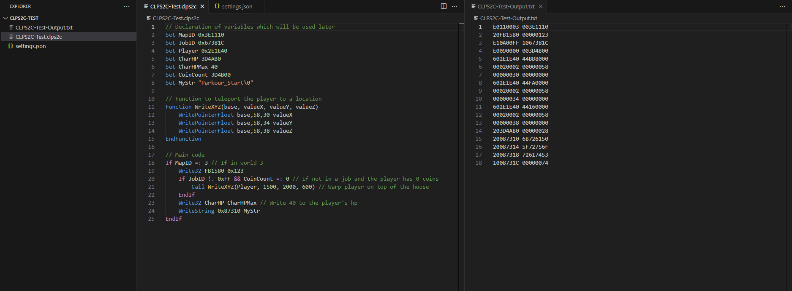

# CLPS2C (Custom Language for PlayStation 2 Cheats) - Visual Studio Code extension

  

## Description
A Visual Studio Code extension that provides language support for .clps2c files.

## How to use
1. Get [CLPS2C-Compiler](https://github.com/NiV-L-A/CLPS2C-Compiler) 
Optional: Add CLPS2C-Compiler.exe's folder to the PATH environment variable (restart Visual Studio Code if already open).
2. Download the "CLPS2C-Test" folder from this repository.
3. In Visual Studio Code open the Extension window (Ctrl+Shift+X), search for "clps2c" and install the extension.
4. In Visual Studio Code open the "CLPS2C-Test" folder by selecting 'File -> Open Folder'.
5. The extension uses a "settings.json" file to communicate with the compiler. The file must be in the same folder as the input file. Edit the "settings.json" file following these guidelines. There are 4 possible key-value pairs:
- `"exe"`. It specifies the filepath of CLPS2C-Compiler.exe.
  - If it's in the PATH environment variable, set its value to "undefined". If not, explicitly declare the filepath: 
  `"exe": "C:\\Users\\admin\\Downloads\\CLPS2C-Compiler\\CLPS2C-Compiler.exe"`
  - If the filepath contains spaces, two single quotation mark symbols (') must be placed after the root of the path (e.g. "C:\\\\") and at the end: 
  `"exe": "C:\\'Users\\admin\\Downloads\\CLPS2C Compiler\\CLPS2C Test\\My Project\\CLPS2C-Compiler.exe'"`
- `"output"`. It specifies the filepath to which the output will be written to.
  - If the output file should have the same name as the input file with "-Output" appended to the file name, set its value to "undefined". 
  - If the output should be saved to a specific file, modify the value accordingly: 
  `"output": "C:\\Users\\admin\\Downloads\\pcsx2\\cheats\\SCUS-97316_07652DD9testmod.pnach"`
- `"pnach"`. The app, by default, produces RAW lines.
  - Set its value to "true" to convert them to Pnach-formatted lines: 
  `"pnach": "true"`
- `"dtype"`. The app, by default, converts "If" commands to E-type codes.
  - Set its value to "true" to convert them to D-type codes: 
  `"dtype": "true"`
6. Open the "CLPS2C-Test.clps2c" file.
7. Access Visual Studio Code's command palette by pressing CTRL+SHIFT+P or F1 and select:
- `CLPS2C: Compile CLPS2C` to parse the opened file (the file that currently is in focus). Note that the command automatically saves the file.
- `View: Toggle Terminal` to reveal the terminal window if it's hidden. A terminal with the name "CLPS2C-Terminal" will display the launched command (it gets created after running the "CLPS2C: Compile CLPS2C" command for the first time).
- `CLPS2C: Paste example code` to paste a CLPS2C example code.
- `CLPS2C: Assembly - Paste example code` to paste a CLPS2C example code that uses assembly.
- `CLPS2C: Assembly - Paste registers` to paste a documentation of register-use convention used in assembly.
- `CLPS2C: Assembly - Paste arithmetic instructions` to paste common arithmetic instructions used in assembly.
- `CLPS2C: Assembly - Paste logical instructions` to paste common logical instructions used in assembly.
- `CLPS2C: Assembly - Paste load and store instructions` to paste common load and store instructions used in assembly.
- `CLPS2C: Assembly - Paste branch and jump instructions` to paste common branch and jump instructions used in assembly.
- `CLPS2C: Assembly - Paste floating point instructions` to paste common floating point instructions used in assembly.

## Troubleshooting
- `CLPS2C: Compile CLPS2C` command doesn't seem to work.
  - Open the "CLPS2C-Terminal" terminal by executing the command `View: Toggle Terminal` in Visual Studio Code's command palette.
  - Make sure the console does not specify any errors.
  - If the value of the `"exe"` key in the settings.json file contains spaces, two single quotation mark symbols (') must be placed after the root of the path (e.g. "C:\\\\") and at the end: 
  `"exe": "C:\\'Users\\admin\\Downloads\\CLPS2C Compiler\\CLPS2C Test\\My Project\\CLPS2C-Compiler.exe'"`

## Credits
Author:
- NiV-L-A

Special thanks:
- Icon made by Cooper941: https://www.youtube.com/@Cooper941
- TheOnlyZac for suggesting how to handle certain scenarios: https://github.com/TheOnlyZac
- Testing done by: [zzamizz](https://github.com/zzamizz)
